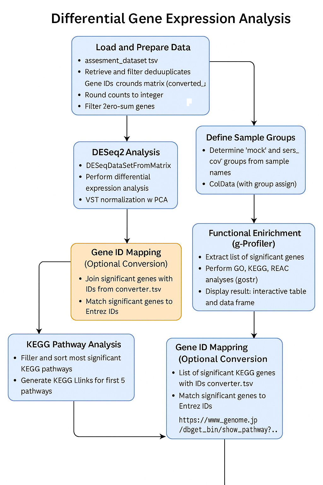
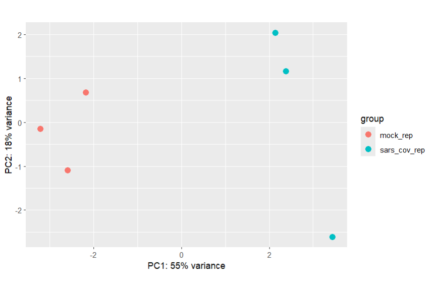

# 🧬 Differential Gene Expression Analysis Pipeline

Bu proje, `mock_rep` ve `sars_cov_rep` örnek grupları arasında diferansiyel gen ekspresyonu analizi gerçekleştirmek amacıyla hazırlanmıştır. Aşağıda analiz süreci detaylı adımlarla açıklanmıştır.

---

## 🔄 Analiz İş Akışı

Bu görselde veri hazırlığından KEGG analizine kadar tüm analiz adımları özetlenmektedir.

---

## 📊 PCA Görselleştirmesi

Aşağıdaki PCA grafiği, örnekler arasındaki varyansı ve grupların ayrımını göstermektedir:

---

## 📦 Gerekli Paketler

library(tidyverse)
library(DESeq2)
library(gprofiler2)
library(ggplot2)

Veri Yükleme ve Hazırlama
assesment_dataset.tsv dosyası yüklenir.

Gen IDleri (converted_alias) alınır, tekrar edenler filtrelenir.

Sayımlar tam sayıya yuvarlanır.

Sıfır toplamlı genler filtrelenir.

🧪 Diferansiyel Gen Ekspresyonu Analizi
DESeqDataSetFromMatrix ile DESeq2 nesnesi oluşturulur.

Varyans stabilizasyon dönüşümü (VST) yapılır.

PCA ile örnek dağılımı görselleştirilir.

DESeq() fonksiyonu ile analiz gerçekleştirilir.

lfcShrink() ile log2 fold değişimleri stabilize edilir.

🎯 Anlamlı Genlerin Filtrelenmesi
padj < 0.05 olan genler filtrelenir.

Anlamlı genlerin Ensembl ID listesi çıkarılır.

📈 Fonksiyonel Zenginleştirme (gProfiler)
gost() fonksiyonu ile zenginleştirme analizi yapılır:

GO:BP (Biyolojik Süreçler)

GO:MF (Moleküler Fonksiyonlar)

KEGG

REAC (Reactome)

Anlamlı terimler; terim adı, p-değeri ve katkıda bulunan gen sayısı ile sunulur.

🧬 Entrez ID Dönüşümü
converter.tsv dosyası ile Ensembl ID → Entrez ID dönüşümü yapılır.

left_join() ile eşleşme sağlanır.

🧪 KEGG Yol Analizi
KEGG kaynaklı terimler filtrelenir.

p-değerine göre sıralanır.

İlk 5 KEGG yoluna bağlantı oluşturulur:

text
Kopyala
Düzenle
https://www.genome.jp/dbget-bin/show_pathway?ID1
https://www.genome.jp/dbget-bin/show_pathway?ID2
...
(Gerçek KEGG bağlantıları analiz sırasında otomatik oluşturulur.)

📂 Çıktılar
res_df: Anlamlı farklı ifade edilen genler.

enrichment_table: gProfiler çıktıları (zenginleşmiş terimler).

entrez_ids: KEGG/GO analizleri için kullanılacak Entrez ID listesi.

Dosya Yapısı
Kopyala
Düzenle
project/
├── assesment_dataset.tsv
├── converter.tsv
├── analysis_script.R
├── EnformatikWorkflow.png
├── a285b7fe-*.png
└── README.md

📌 Notlar
Analiz, hsapiens (insan) organizması için yapılmıştır.

gProfiler analizinde g_SCS düzeltme yöntemi kullanılmıştır.

Tüm analizler R ortamında gerçekleştirilmiştir.